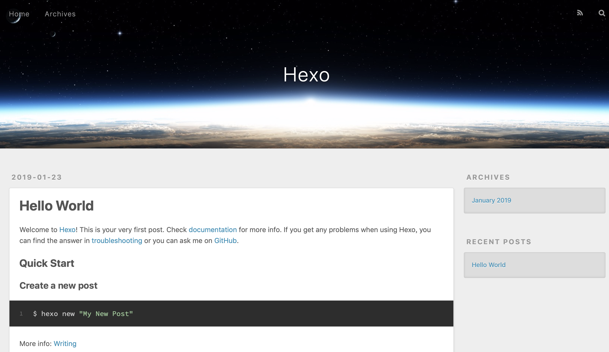
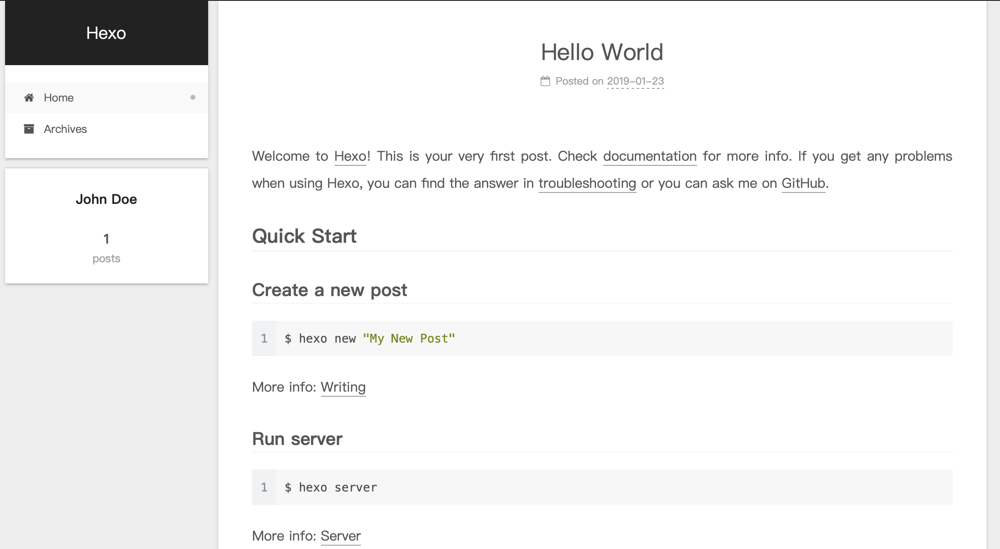

# 前言
虽然目前有很多网站可以一键创建博客，但是效果千篇一律，可玩性也比较低，本着折腾的精神，便想尝试下自建博客，在排版、功能上的自由度也非常高，把学习过程中的点点滴滴记录下来，目前比较主流的搭建方式是Github+Hexo，本文简单介绍下基础的搭建方法。
<!--more-->

# 准备工作
1. Node.js
2. Git
3. Github账号

各个平台的安装方式不同，这里不阐述

# 安装
``` bash
$ npm install -g hexo-cli
```
# 建站
``` bash
$ hexo init <folder>
$ cd <folder>
$ npm install
```
博客初始化完成，目录如下:
```
.
├── _config.yml
├── node_modules
├── package-lock.json
├── package.json
├── scaffolds
├── source
└── themes
```
* _config.yml: 网站配置，标题，主题等
* source: 博客文档资源，例如用户编写的Markdown文档
* themes: 用户主题，可以从网上下载不同的主题放进去

# 编辑
*Tips:以下指令参数可以用首字母代替*

新建一篇文章
``` bash
$ hexo new <title>
```
在source/_posts/目录下生成文章，即可编辑

生成
``` bash
$ hexo generate
```

启动本地服务器预览
``` bash
$ hexo server
```


**于是通过 http://localhost:4000 便可预览博客的效果了**


# 主题
在[Hexo官方主题列表](https://hexo.io/themes/)中，可以挑选你喜欢的主题，我选用的是比较简约的[NexT](https://theme-next.org)
``` bash
$ cd <folder>
$ git clone https://github.com/theme-next/hexo-theme-next themes/next
```
在_config.yml中将themes设置为NexT即可

在thems/next/_config.yml中可以对主题进行进一步配置，例如修改主题风格：
```
scheme: Gemini
```

主题预览：


# 部署
结合Github Page配置，可以将博客设置为Github个人主页

1. 新建Github仓库，仓库名为 xxx(Github用户名).github.io
2. 安装拓展
``` bash
$ npm install hexo-deployer-git --save
```
3. 修改配置：
```
deploy:
  type: git
  repo: 仓库路径
  branch: 推送的分支
```
4. 部署
```bash
$ hexo deploy
```
Done!
通过xxx(Github用户名).github.io即可访问博客

# 参考
[Hexo官方文档](https://hexo.io/zh-cn/docs/)
[NexT使用文档](http://theme-next.iissnan.com)
